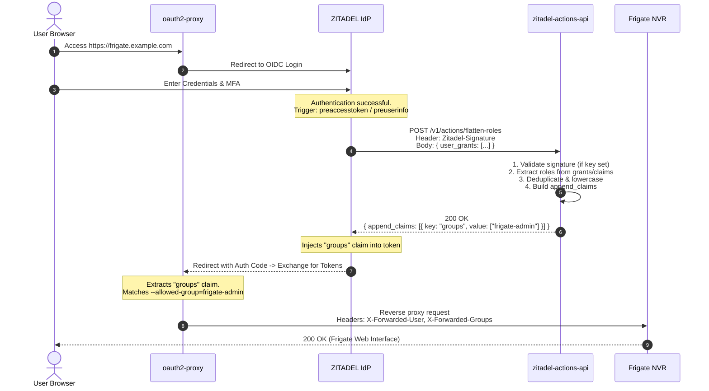

# Architecture: zitadel-actions-api

## Overview

`zitadel-actions-api` is a lightweight, stateless microservice written in Go designed to act as a backend endpoint for **ZITADEL Actions**.

Its primary initial purpose is solving the role representation mismatch between ZITADEL's native nested role maps and OIDC consumers like `oauth2-proxy`, which expect a simple string array claim (`groups: ["admin", "viewer"]`).

## Data Flow



## Input Normalization

ZITADEL passes user roles in different formats depending on the API version and configuration:

1. **Actions V2 Target Payload (`user_grants`)**:
   ```json
   {
     "user_grants": [
       {
         "projectId": "2638491028301",
         "roles": ["frigate-admin", "viewer"]
       }
     ]
   }
   ```
2. **Actions V1 / Custom JS Payload (`grants`)**:
   ```json
   {
     "grants": [
       {
         "projectId": "2638491028301",
         "roles": ["frigate-admin"]
       }
     ]
   }
   ```
3. **Legacy Claims Map (`urn:zitadel:iam:org:project:roles`)**:
   ```json
   {
     "claims": {
       "urn:zitadel:iam:org:project:roles": {
         "frigate-admin": { "2638491028301": "My Organization" }
       }
     }
   }
   ```

`zitadel-actions-api` parses all of the above structures simultaneously, deduplicates the role names, and returns a sorted array.

## Output Specification

The service returns a payload designed to satisfy both ZITADEL Actions V2 and direct HTTP consumers:

```json
{
  "append_claims": [
    {
      "key": "groups",
      "value": ["frigate-admin", "viewer"]
    }
  ],
  "groups": ["frigate-admin", "viewer"],
  "claims": {
    "groups": ["frigate-admin", "viewer"]
  }
}
```

- **`append_claims`**: Read natively by ZITADEL Actions V2 when the target is configured with `restCall`.
- **`groups` & `claims`**: Can be used by Actions V1 JavaScript scripts or tested via `curl`.

## Extensibility

The codebase is structured to facilitate adding more action handlers:
- `internal/handler/`: Add new handlers (e.g. `validate_user.go`, `sync_ldap.go`) without touching core routing.
- `internal/service/`: House independent business logic components.
- `internal/middleware/`: Reusable middleware for signature validation, structured logging, and panic recovery.
